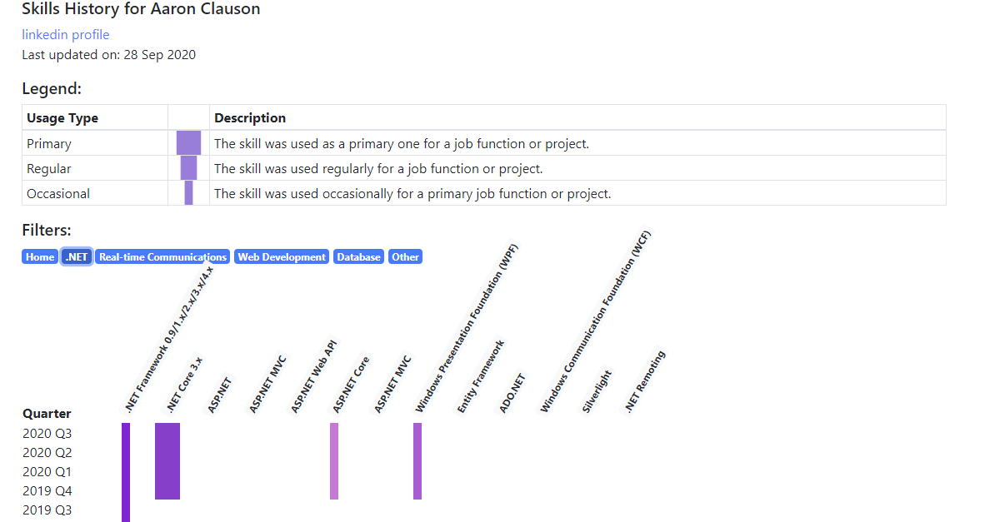

# Shills History Chart

This project contains a single HTML file that can displays your skills history in an intuitive chart. Skills can be grouped into top level categories and then drilled down to provide the level of detail required.

The original motivation for this chart was to be able to succinctly display a history of Information Technology/Software Development skills to recruitment consultants.

## Example:



# Usage

If you want to host the chart on your own site:

1. Copy the following files to your site:
  - `index.html`
  - `occasional.png`
  - `primary.png`
  - `regular.png`
  - `skillshistorydata.js`

2. Edit `skillshistorydata.js` and set your own data (see [Skills History Data](#skills-history-data)).
3. Open `index.html` in a browser.

If you want to take advantage of GitHub pages hosting:

1. Fork this repository.
2. Edit `skillshistorydata.js` and set your own data (see [Skills History Data](#skills-history-data)).
3. In your repository's settings [enable GitHub Pages](https://docs.github.com/en/free-pro-team@latest/github/working-with-github-pages/creating-a-github-pages-site).
4. Browse to your GitHub pages site and enter the `index.html` as the URL to view the chart, e.g. [https://sipsorcery.github.io/skillshistory/index.html](https://sipsorcery.github.io/skillshistory/index.html).

# Skills History Data

The data for the chart is contained in the separate `skillshistorydata.js` file. It contains 3 objects for:

 - `headerBlockData`: for the header information at the top of the chart.
 - `skillFilters`: for a list of pre-configured filters to make available.
 - `skillsHistory`: for the skills history data.

 ## `headerBlockData`

This object contains 3 properties that map directly to the header at the top of the chart HTML page.

Example:

```javascript
 const headerBlockData = {
    description: "Skills History for Aaron Clauson",
    linkedinprofile: "https://www.linkedin.com/in/aaron-clauson-81770144/",
    lastupdatedat: "28 Sep 2020"
};
```

## `skillFilters`

This object contains an optional array (can be set to empty of no filters are required) to display a list of pre-configured filters above the chart. Clicking on a filter drills down the skills chart to display child skills.

Each filter has two properties:
 - `displayname`: is what gets displayed on the HTML page for the name of the filter.
 - `filter`: the `name` or `id` for the skills entry to display child skills for. This value must correspond to an entry in the `skillsHistory` array.

```javascript
const skillFilters = [
    { displayname: ".NET", filter: ".net"},
    { displayname: "Real-time Communications", filter: "rtc"},
];
```

## `skillsHistory`

This is the most important object for the chart. It contains the skill history data used to construct the chart.

The object consists of an array of skills entries. Each array entry consists of some properties and an array of usage data. The available properties are:

 - `name`: the name of the skill and what will be shown in the chart table header when this skill is being displayed.
 - `colour`: the colour to represent this skill's usage with.
 - `id`: optional. If this skill represents a larger skill group then this `id` should be set to that child skills can be associated with it.
 - `parentid`: optional. If this skill is part of a larger skill group then this should be set to the `id` of the parent skill. This property can also be set as an array if the skill fits into multiple parent groups.

In the example below the `WPF` skill is a child of the `.NET` skill. When first loaded only skills that have no `parentid` are displayed. 

```javascript
const skillsHistory = [
{
  name: "C#/.NET/.NET Core",
  id: ".net",
  colour: "a27bdc",
  history: [ 
    { period: 20201, usage: "regular" },
  ]
},
{
  name: "Silverlight",
  colour: "034a88",
  parentid: [".net","webdev"],
  history: [ 
    { period: 20151, usage: "primary" },
  ]
}]
```

### History Entries

The second part of each array is the list of usage entries. A usage entry represents how a particular skill was used for a specific period of time, in this case a quarter of a year, e.g. `20151` represents Quarter 1 (Jan-Mar) of the year 2015.

The usage classifications are:

 - `primary`: the skill was used as a primary one for a job function or project.
 - `regular`: the skill was used regularly for a job function or project.
 - `occasional`: the skill was used occasionally for a primary job function or project.

For periods here a skill was not sued at all no entry should be supplied.

 ```javascript
{
	name: "C/C++",
	colour: "78ccf0",
	history: [
		{ period: 20203, usage: "regular" },
		{ period: 20201, usage: "regular" },
		{ period: 20182, usage: "primary" },
		{ period: 20181, usage: "primary" },
		{ period: 20174, usage: "primary" },
		{ period: 20164, usage: "regular" },
	]
}
 ```

 **NOTE:** In the event anyone else finds this project useful it's likely both the time period and usage classifications will not be ideal. I'm more than happy to accept pull requests to enhance the flexibility in this and any other area.

 # Linkedin Integration

 The Skills section available in Linkedin Profiles is very poor. This chart can be used to supplement the information available in your Profile.

 

 To include the chart as shown in the Screenshot above:

 - Make sure to edit your `index.html` file to set the metadata fields to match your own site. The metadata fields required by Linked in are described [here](https://www.linkedin.com/help/linkedin/answer/46687). The two properties below need to have the `content` set to match wherever your page is hosted:
   - `<meta property='og:image' content='https://sipsorcery.github.io/skillshistory/skillshistory_demo.png'/>`
   - `    <meta property='og:url' content='https://sipsorcery.github.io/skillshistory/index.html'/>`
 - In your Linkedin Profile click `Add Profile Section->Links`,
 - In the `Add a link` form set the link to the HTML page of your skills chart, this can be your GitHub pages site, e.g. `https://sipsorcery.github.io/skillshistory/index.html`,
- Enter a `Title` and `Description`.
- If Linkedin can find your page and accepts the `metadata` values then your image should be displayed as shown below. If your image does not get displayed double check the metadata fields were set correctly in the first step and check your page using [Linkedin Post Inspector](https://www.linkedin.com/post-inspector/inspect/).


